# Activity 1 - Microservices with Database Migrations & GraphQL CRUD  

### Description  

In this activity, I built two microservices—**Users** and **Posts**—each with its own database. The goal was to apply database migrations and set up GraphQL endpoints for CRUD operations.  

### Activity Requirements

- Create two separate microservices: `users-service` and `posts-service`.  
- Initialize a *Node.js* project in each folder with necessary dependencies (e.g., Prisma, Apollo Server, SQLite).  
- Configure a `Prisma` schema for each service:  
  - `users-service`: Defines a `User` model with an `id` and at least two other fields.  
  - `posts-service`: Defines a `Post` model with an `id` and at least two other fields.  
- Apply database migrations to create the databases and tables.  
- Implement a GraphQL server in each microservice using Apollo Server:  
  - Define schema types and CRUD queries/mutations.  
  - Write resolvers to handle CRUD operations using Prisma.  
- Run each service on a different port (e.g., 4001 for Users, 4002 for Posts).  
- Test all *CRUD* endpoints using a GraphQL client (e.g., GraphiQL) to ensure proper functionality.  

### Submission  

Includes:  
- Project files for both microservices.  
- Screenshot for CRUD Functionalities for both microservices.  
- A short reflection (3-5 sentences) addressing:  
  - The purpose and benefits of database migrations.  
  - How GraphQL differs from REST for CRUD operations.

### Reflection

1. **What do database migrations do, and why are they useful?**  
   Database migrations are a way to manage changes to your database schema over time in a structured and version-controlled manner. They allow you to create, update, or delete database tables and columns without manually writing SQL queries. Migrations are useful because they ensure consistency between different environments (e.g., development, testing, production) and make it easier to collaborate with others. They also provide a history of changes, making it simple to roll back to a previous state if something goes wrong. Overall, migrations streamline database management and reduce the risk of errors during schema updates.

2. **How does GraphQL differ from REST for CRUD operations?**  
   GraphQL differs from REST in how it handles CRUD operations by providing a single endpoint for all queries and mutations, unlike REST, which typically uses multiple endpoints for different resources. With GraphQL, clients can request exactly the data they need, reducing over-fetching or under-fetching of data. Additionally, GraphQL allows for more flexible and efficient data retrieval, as clients can specify nested relationships in a single query. While REST relies on predefined endpoints and HTTP methods, GraphQL uses a schema and resolvers to dynamically handle requests, making it more adaptable to evolving client requirements.

### Screenshots for Users CRUD functionalities

CREATE:  
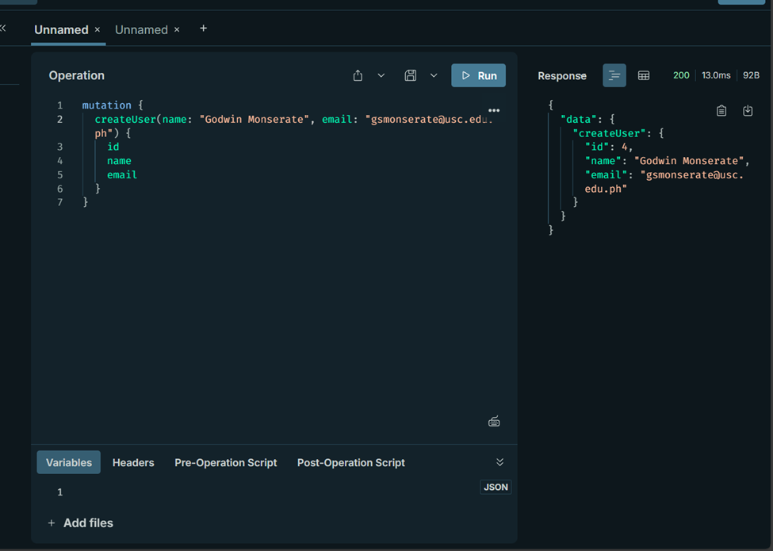  
READ:  
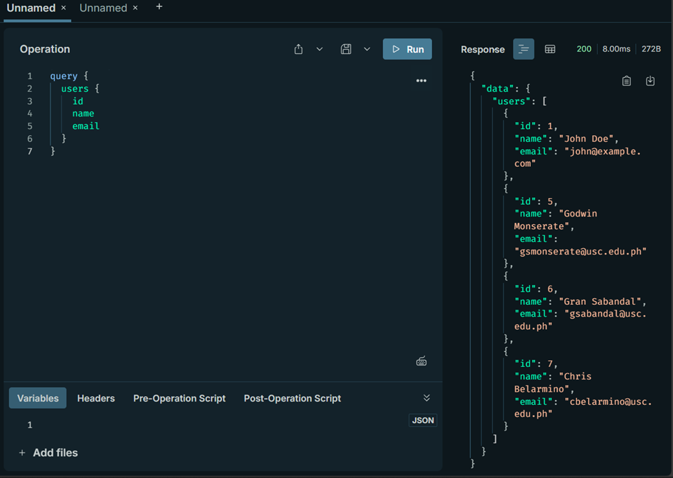  
UPDATE:  
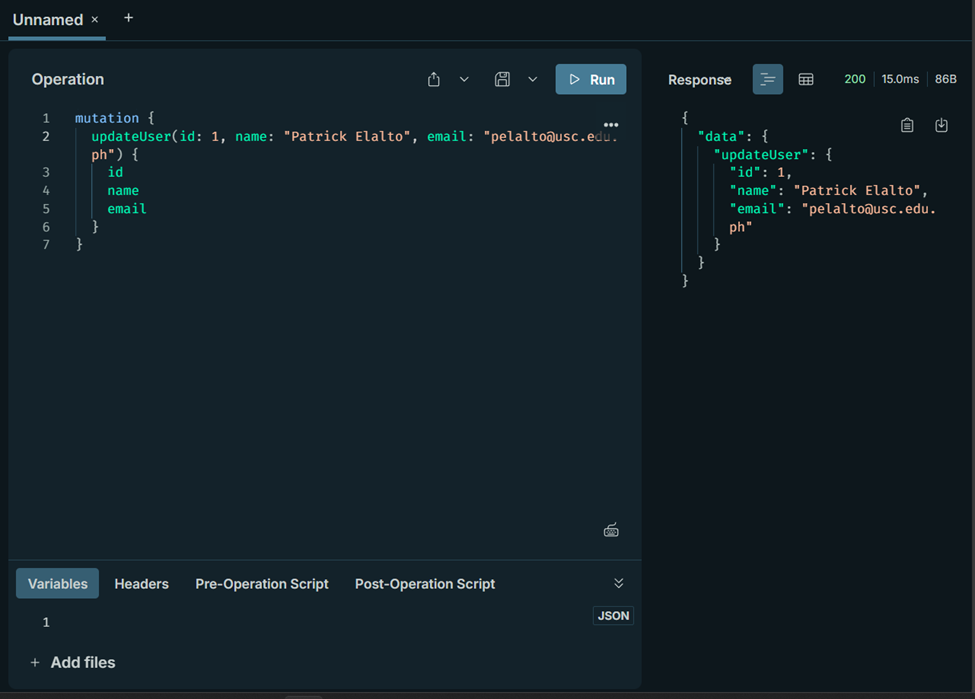  
BEFORE UPDATING:  
  
AFTER UPDATING:  
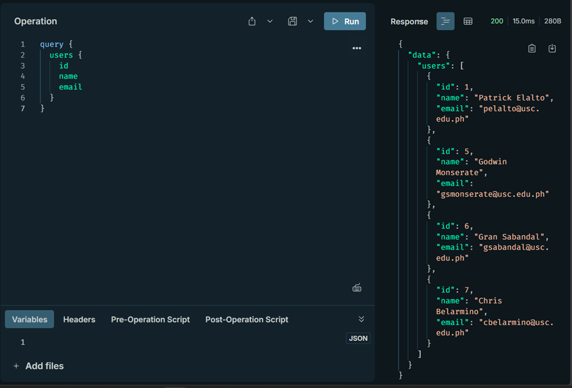  
DELETE:  
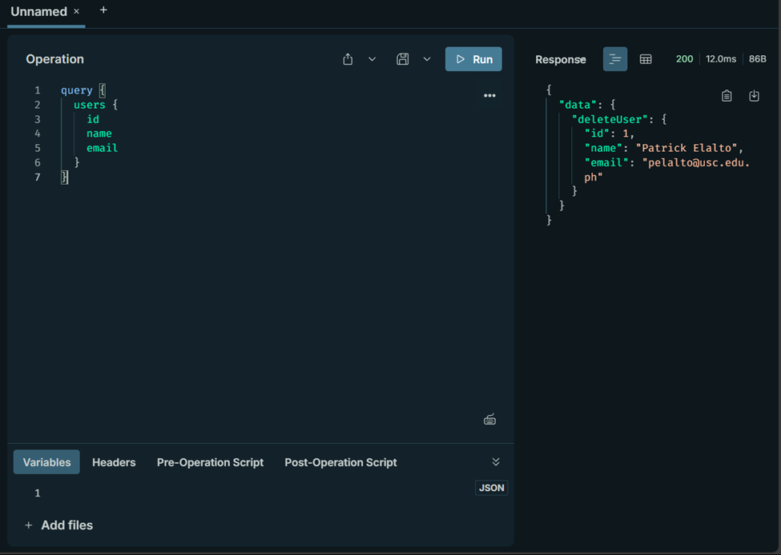  
BEFORE DELETING:  
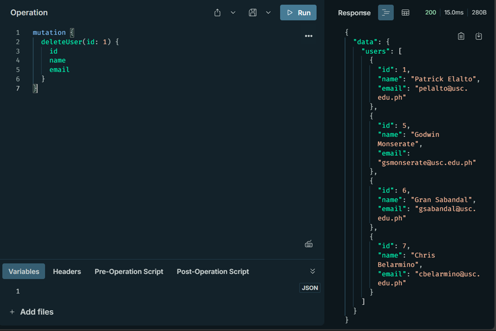  
AFTER DELETING:  
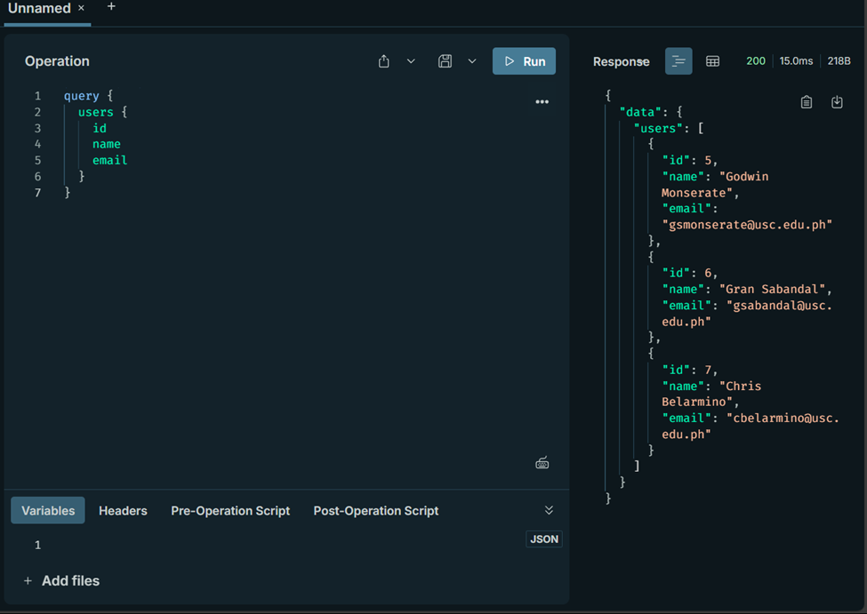  

### Screenshots for Posts CRUD functionalities

CREATE:  
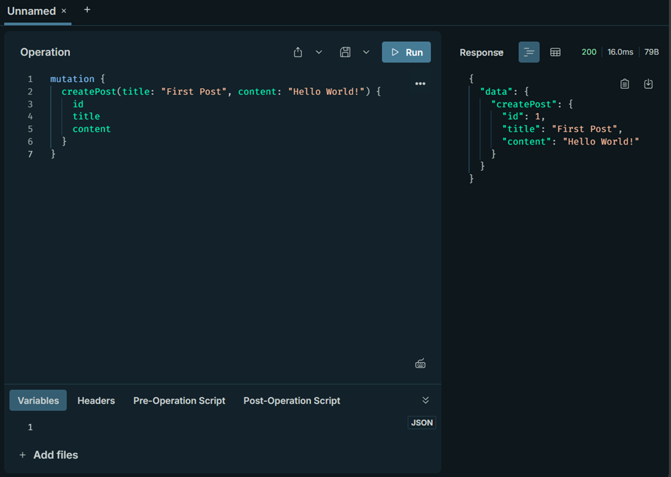  
READ:  
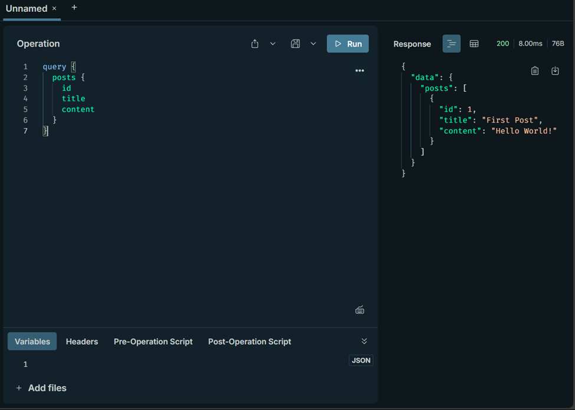  
UPDATE:  
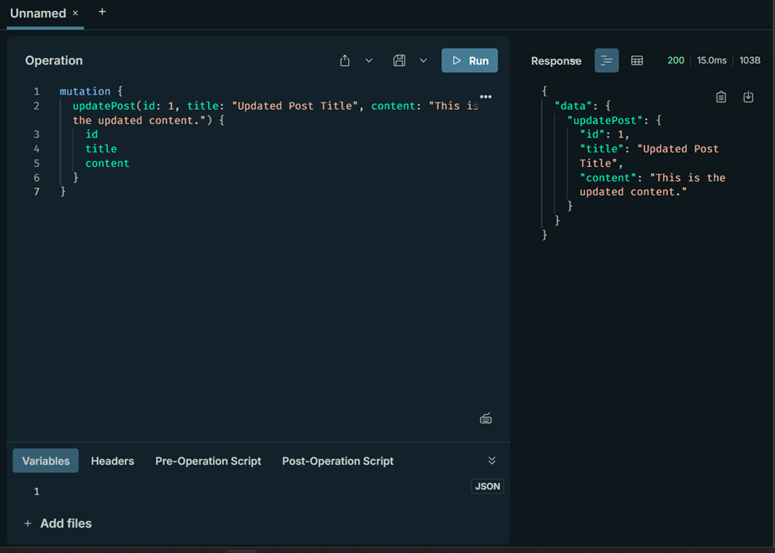  
BEFORE UPDATING:  
  
AFTER UPDATING:  
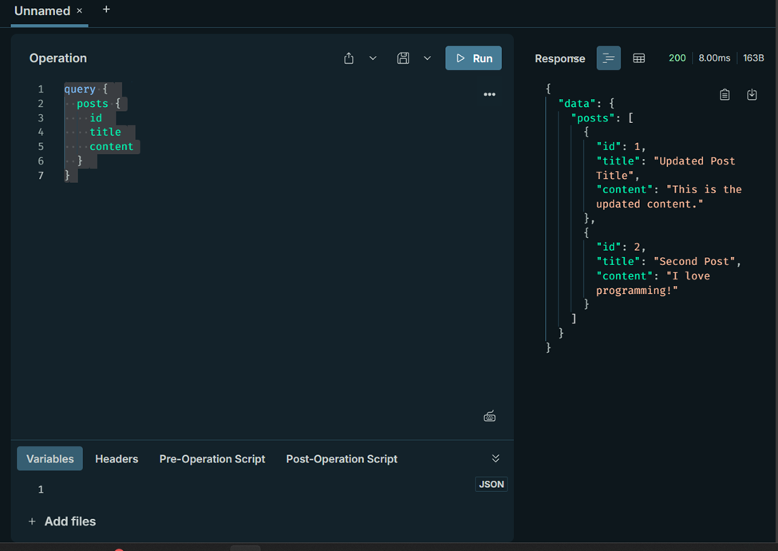  
DELETE:  
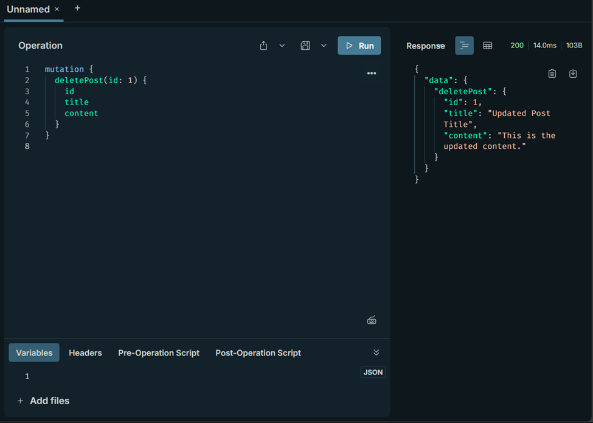  
BEFORE DELETING:  
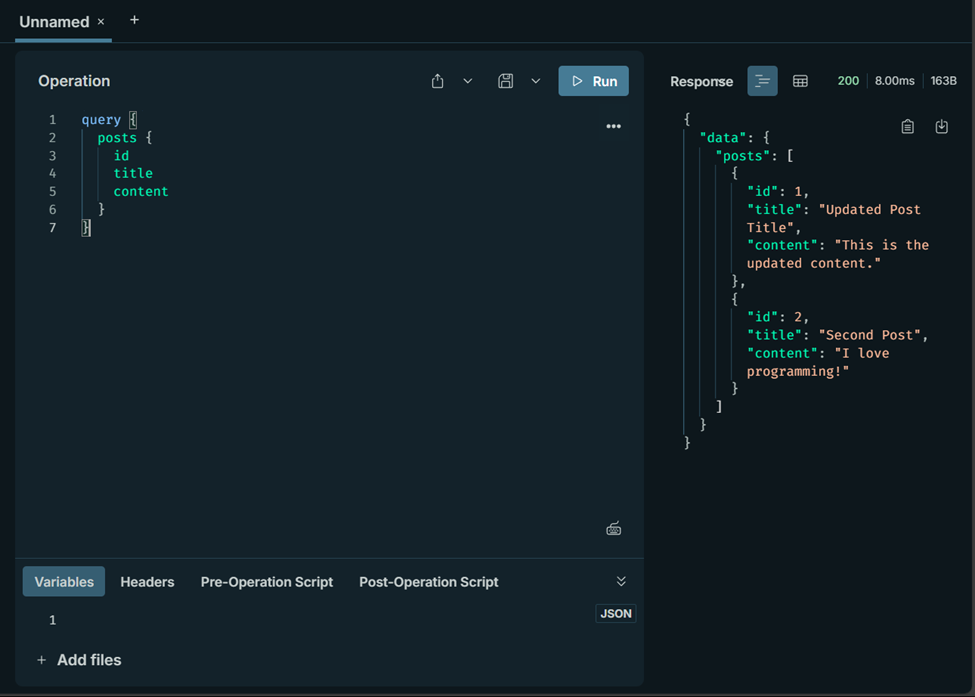  
AFTER DELETING:  
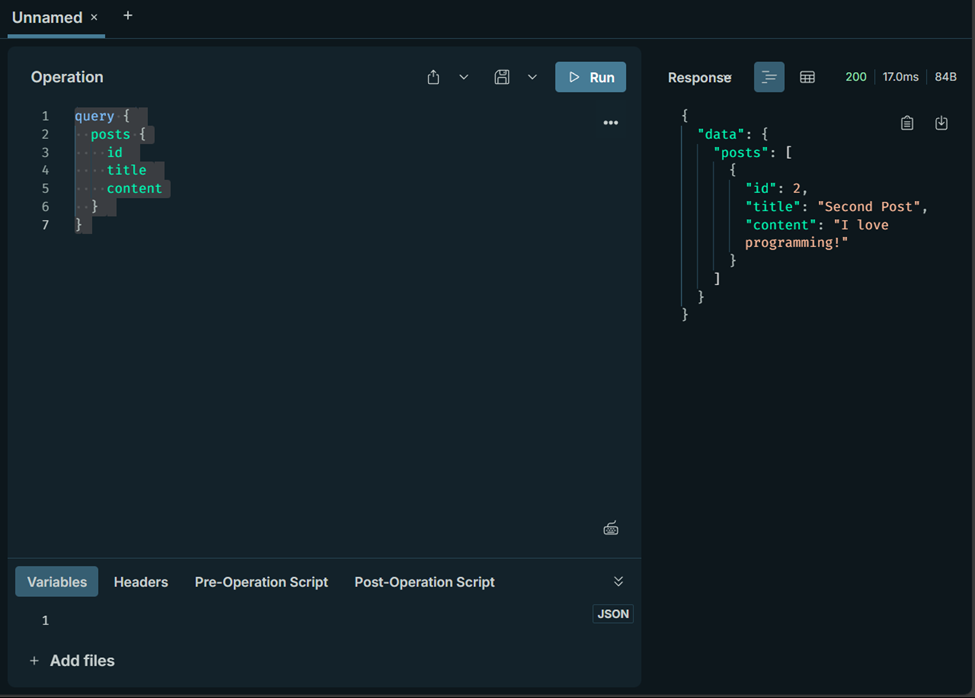  